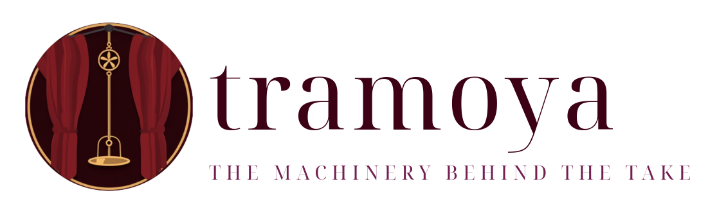
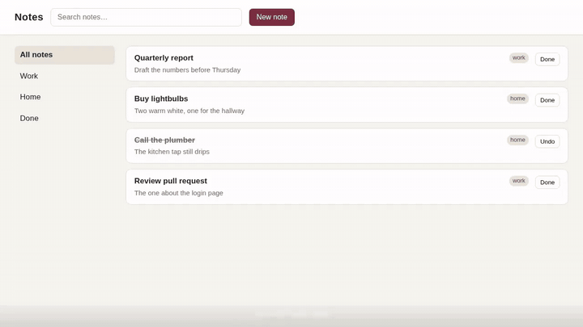
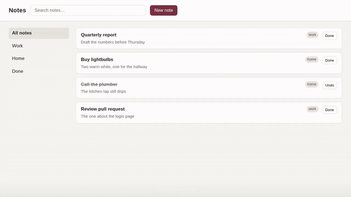
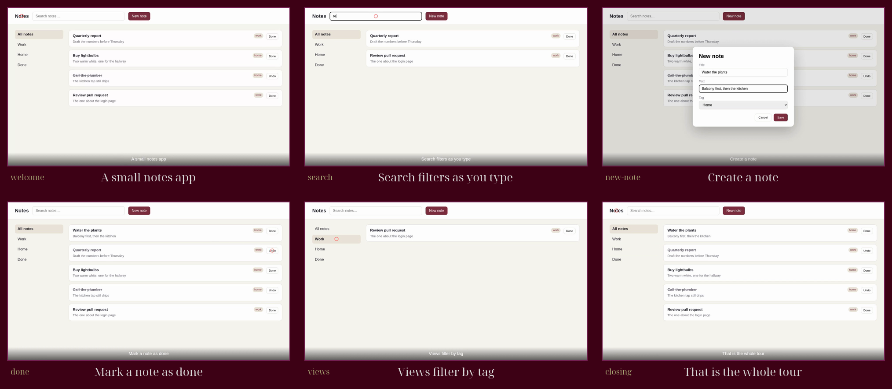

<div align="center">

<picture>
  <source media="(prefers-color-scheme: dark)" srcset="assets/logo-dark.png">
  
</picture>

<p>
<em>The <strong>tramoya</strong> is the machinery behind a stage: ropes, battens, trapdoors.<br>
The audience never sees it. The show runs on time because of it.</em><br>
<strong>This is that machinery for recorded software demos: you write scenes, it keeps the clock, the cursor, the voice and the cut.<br>Or you just say what you want, and it works out the commands.</strong>
</p>

<p>
  
  
  
  
  
</p>

<a href="#-install"><strong>Install</strong></a> ·
<a href="#-the-demo"><strong>The demo</strong></a> ·
<a href="#-scene-by-scene"><strong>Scene by scene</strong></a> ·
<a href="#-just-say-it"><strong>Just say it</strong></a> ·
<a href="#-why-this-exists"><strong>Why</strong></a> ·
<a href="#-what-you-get"><strong>What you get</strong></a> ·
<a href="#-60-second-tour"><strong>60-second tour</strong></a> ·
<a href="#-the-pipeline"><strong>The pipeline</strong></a> ·
<a href="#-module-map"><strong>Module map</strong></a> ·
<a href="#-verification"><strong>Verification</strong></a>

</div>

---

<a href="#-the-pipeline"></a>

<div align="center">

**stage** Playwright · **recorder** wf-recorder or the browser itself · **voice** Kokoro · **cut** ffmpeg · **marks** one JSON file<br>
**core deps** none · **extras** `[playwright]` `[tts]` · **cli** `tramoya ask | do | marks | assemble | deck | captions | music | cues | record | tts`

<br>

<sub>Two kinds of image on this page. The logo and the diagram are <b>rendered</b> by
<code>scripts/render-assets.sh</code> from the palette in <code>assets/theme.conf</code> (the emblem itself was generated
once with a diffusion model and is kept under <code>assets/brand/</code>). Everything else is <b>real output</b>: the
terminal GIFs are <code>asciinema</code> recordings of the installed command, the demo video was directed, recorded,
voiced and assembled by this package from the example under <code>examples/</code>, and the filmstrip is six frames cut
out of that take at the marks it wrote. No mock-ups, nothing hand-painted. tramoya made its own README.</sub>

</div>

---

## ✂️ In three lines

```bash
pip install "tramoya[playwright,tts] @ git+https://github.com/gitsual/tramoya@v0.3.0"
cd examples/notes-app
tramoya do "record the notes app demo with director.py, give it an English voice and build the final video"
```

That is the whole loop: a director script that names its scenes, a plain-language request, and an `.mp4` at the
end. The rest of this page shows what happened in between, with the real output at every step.

---

## 🎬 The demo

A one-page notes app, six scenes, one minute. Every frame below was produced by the pipeline: the director drove
the page, the browser recorded itself, Kokoro read the script, `assemble` cut it per scene and fitted the voice.

<p align="center">
  <a href="assets/video/notes-demo.mp4"></a>
</p>

<p align="center"><sub>Preview GIF (8 fps, no sound). <a href="assets/video/notes-demo.mp4"><b>Watch the full video with narration</b></a> (59 s, h264 + aac).</sub></p>

### How it was made, start to finish

This is tramoya running over the notes app from a single sentence. Nothing is staged: the terminal is a real
recording of the installed command, and the video at the end is the file it produced.

<p align="center">
  <a href="assets/video/walkthrough.mp4"></a>
</p>

<p align="center"><sub><a href="assets/video/walkthrough.mp4"><b>Watch the walkthrough</b></a> (73 s, h264 + aac): the request, the run, and the result.</sub></p>

**Before.** The folder holds exactly three files, and none of them is a video:

```
examples/notes-app/
├── index.html    the app under demo: a one-page notes list, no build step
├── script.json   what the voice says, one entry per scene, per language
└── director.py   the choreography: six scene functions built on tramoya.stage
```

**During.** One request, and the assistant turns it into a plan, checks it, and runs it step by step:

```
$ tramoya do "record the notes app demo with director.py, give it an English voice and build the final video" --yes

1. Record the demo
   $ tramoya direct director.py --out demo
2. Generate English voiceover
   $ tramoya tts --script script.json --lang en --out-dir voices
3. Assemble final video
   $ tramoya assemble --video demo/take.webm --marks demo/marks.json --voice-dir voices --out final_video.mp4
```

`direct` launches the director: a headless Chromium opens `index.html`, the injected cursor travels and clicks,
the caption band changes per scene, the browser records itself and the director writes `marks.json` as it goes.
`tts` reads `script.json` through Kokoro, one wav per scene. `assemble` cuts the take at the marks, fits each
scene to its clip and concatenates.

**After.** The folder now has the take, the marks, six voice clips and `final_video.mp4`, and the terminal shows
the per-scene table `assemble` printed:

```
scene welcome:    7.6s raw ->  7.8s final
scene search:     7.0s raw ->  7.0s final
scene new-note:  11.1s raw -> 11.2s final
scene done:       7.1s raw ->  7.1s final
scene views:      8.4s raw ->  8.4s final
scene closing:    7.3s raw ->  7.3s final
assembled final_video.mp4
```

That file is the demo at the top of this section.

## 🎞️ Scene by scene

One frame per scene, cut out of `take.webm` at the midpoint of each `scene:<name>` pair in `marks.json`. The
caption under each frame is the label the director wrote when the scene started, so the strip is also a check that
the marks land where the story says they do.

<p align="center">
  <a href="examples/notes-app/demo/marks.json"></a>
</p>

<p align="center"><sub>Rendered by <code>scripts/render-assets.sh filmstrip</code> from the take and the marks. Re-record the demo and the strip follows.</sub></p>

### The same thing by hand

The whole thing lives in [`examples/notes-app/`](examples/notes-app): a self-contained `index.html`, a
`script.json` with one line per scene, and a `director.py` of under a hundred lines. Reproduce it from scratch:

```bash
uv pip install -e ".[dev,playwright,tts]" && uv run python -m playwright install chromium

cd examples/notes-app
tramoya direct director.py --out out                                        # directs + records (headless) -> take.webm, marks.json
tramoya tts --script script.json --lang en --out-dir out/voices/en          # one wav per scene
tramoya marks out/marks.json                                                # the scene table
tramoya assemble --video out/take.webm --marks out/marks.json --voice-dir out/voices/en --out out/demo.mp4
```

`--rehearse` runs the same choreography in a few seconds without recording, and `--pace 0.7` slows the whole
take down. The director is what a product would write: scenes are functions, and every scene gets the stage and a
`say` callback that plays that scene's clip (or waits its length when the clip is missing).

---

## 🗣️ Just say it

You do not have to learn the commands. Describe what you want; a language model turns it into a plan of
`tramoya` commands, the plan is checked against the files that actually exist, and nothing runs until you say so.

<p align="center">
  
</p>

```bash
tramoya ask "put some quiet background music under demo.mp4"     # shows the plan, runs nothing
tramoya do  "build the video with the English voice"             # shows the plan, asks, then runs it
tramoya do  "…" --yes --dry-run                                  # runs it, but every ffmpeg call only prints
```

Three real exchanges, verbatim from the GIF above, with a small local model (`qwen3-coder` through Ollama):

<table>
<tr><th width="34%">You say</th><th>What happens</th></tr>
<tr>
<td><code>put some quiet background music under demo.mp4</code></td>
<td>A two-step plan: synthesize the bed with <code>tramoya music bed --out bed.wav</code>, then
<code>tramoya music mix --video demo.mp4 --bed bed.wav --out demo-with-music.mp4</code>. Each step carries a one-line <em>why</em>.</td>
</tr>
<tr>
<td><code>translate the video into French</code></td>
<td>No steps. The answer explains that voices exist only for English and Spanish, so the request cannot be fulfilled.
The model is told the rule, and <code>preflight</code> would refuse the plan anyway if it tried.</td>
</tr>
<tr>
<td><code>show me the scenes, then build the video with the English voice</code></td>
<td>Two steps: <code>tramoya marks marks.json</code> prints the six-scene table, then <code>assemble</code> cuts the take,
fits each voice clip and writes <code>final-demo.mp4</code>. With <code>--yes</code> it runs straight through.</td>
</tr>
</table>

**Two backends, same plan.** Local and private by default, hosted when you ask for it:

| Backend | How to pick it | Model |
|---|---|---|
| **Ollama** (local) | default when no key is set; `--backend ollama`; `TRAMOYA_LLM=ollama` | `qwen3-coder`, or `--model` / `TRAMOYA_LLM_MODEL` (`OLLAMA_HOST` to point elsewhere) |
| **Claude** (API) | `ANTHROPIC_API_KEY` set; `--backend claude`; `TRAMOYA_LLM=claude` | `claude-sonnet-5`, or `--model` / `TRAMOYA_LLM_MODEL` |

**What keeps it honest.** The model only proposes; the package decides.

- The model sees the command reference and the files in the current directory, and answers in strict JSON. A reply
  that is not a plan gets **one repair round**, then the error is yours to read.
- **Preflight** rejects a plan before anything runs: an input that does not exist, a language with no voices, a
  file used as a narration script that is not one, a `direct` step with no director script. It also knows what
  each step produces, so `assemble` may consume the `take.webm` that `direct` will write two steps earlier.
- `run_plan` executes **only `tramoya` commands**, in order, and stops at the first failure. Nothing else the model
  writes is ever passed to a shell.
- `tramoya do --dry-run` appends `--dry-run` to every step that would encode, so the whole plan can be inspected
  as ffmpeg argv first.

---

## 📥 Install

```bash
pip install "tramoya @ git+https://github.com/gitsual/tramoya@v0.3.0"
pip install "tramoya[playwright] @ git+https://github.com/gitsual/tramoya@v0.3.0"   # + Stage
pip install "tramoya[tts] @ git+https://github.com/gitsual/tramoya@v0.3.0"          # + Kokoro voice
```

The core has **no Python dependencies**. Pin the tag: the package is consumed by git URL and the tag is the contract.

> [!NOTE]
> `ffmpeg`, `ffprobe`, `wf-recorder`, `paplay` and `pactl` are external binaries, looked up at run time only by the
> command that needs them. `assemble`, `deck`, `captions` and `music` need ffmpeg; `record` needs wf-recorder (Wayland
> only); `direct` needs the `[playwright]` extra plus a Chromium; `tts` needs the `[tts]` extra; `ask` / `do` need a
> running Ollama or an Anthropic key. Nothing is checked at install time: install what the commands you use need.

<details>
<summary><b>Arch Linux</b></summary>

```bash
sudo pacman -S ffmpeg wf-recorder libpulse
uv run python -m playwright install chromium      # only for direct
```
</details>

<details>
<summary><b>Debian / Ubuntu</b></summary>

```bash
sudo apt install ffmpeg wf-recorder pulseaudio-utils
uv run python -m playwright install --with-deps chromium
```
</details>

<details>
<summary><b>macOS</b></summary>

```bash
brew install ffmpeg
uv run python -m playwright install chromium
```
`record` is Wayland-only; on macOS use `direct` (the browser records itself) or a screen recording of your own plus a cue file.
</details>

With `uv`, from a checkout:

```bash
uv venv && uv pip install -e ".[dev,playwright]"
tramoya --version
```

---

## 🎨 Why this exists

A product demo is a small film. Somebody has to keep the clock, move the cursor legibly, say the right
line at the right moment, remember where each scene started so the editor can cut, and then do the editing:
speed up the two minutes where a backend was thinking, freeze the frame while the narration finishes,
burn the captions, lay a bed of music under the voice.

That machinery tends to get rewritten for every demo of every product, each time slightly differently. Marks end
up in several JSON shapes. The scene timeline gets written only when the director exits, so a crash at scene nine
leaves nothing. Pacing lives in module globals that must be kept in sync by hand.

None of that depends on what is being shown. So it lives here, under one name, with tests. A product keeps
exactly what belongs to the product: its pages, its script, its texts.

| Step | The usual way | What goes wrong | With tramoya |
|---|---|---|---|
| Driving the app | A human with a mouse, three takes | A shaky cursor, a missed click, a typo on take three | A director script: scenes are functions, the cursor is drawn and travels legibly, every take is identical |
| Knowing where scenes start | Notes on paper, or the editor scrubs | Nobody remembers where scene nine began | `marks.json`, flushed after every mark, so even a crashed take has its timeline |
| The voice | Record yourself, re-record for each edit | Every script change is a new session in front of the mic | One wav per scene from a JSON script; change a line, regenerate one file |
| Waiting on a backend | Cut it out by hand in an editor | Two minutes of nothing, or a jump cut with no explanation | Any wait over 20 s is compressed to ~4 s with a caption saying how long it really was |
| Fitting voice to picture | Trim, stretch, guess | The narration ends after the scene did | The last frame freezes until the voice ends; short clips are padded |
| Trying a change | Render the whole thing again | Minutes per attempt | `--dry-run` prints every ffmpeg call and encodes nothing |
| Remembering the commands | Read the docs again | You do it once a quarter and forget | `tramoya do "…"`: a plan, a preflight, a confirmation |

**The rule that shapes the package:** every ffmpeg invocation goes through a `Runner`. In `dry_run` mode
it records the argv and touches nothing. That is what makes a video pipeline testable without paying an
encode per test, and what makes `tramoya do --dry-run` possible.

---

## ✨ What you get

| Piece | What it does | Where |
|---|---|---|
| **Assistant** | A request in plain language becomes a plan of `tramoya` commands (Ollama or Claude), checked by a deterministic preflight and run only after confirmation. | `assistant.py` |
| **Marks** | A tiny timeline (`scene:<name>:start\|end`, `wait:start\|end`) flushed to disk after **every** mark, so a crashed take still leaves its marks. Loads older Spanish-keyed files unchanged. | `marks.py` |
| **Pacing** | One object for tempo, language and rehearsal mode instead of three globals. `pace` scales every sleep and timeout; `rehearse` runs the whole choreography in seconds. | `pacing.py` |
| **Narrator** | Plays one voice clip per scene through an injectable player, falls back to a timed pause when the clip is missing, and never blocks the take on a missing file. | `narration.py` |
| **Stage** | A Playwright page with a **visible cursor**, a click ripple and a caption band injected into any web app, plus legible mouse travel, a scene registry with decorators, and optional in-browser video recording. | `stage.py` |
| **Recorder** | Drives `wf-recorder` and writes the **offset sidecar**: the recorder's start and the director's start read from `/proc/<pid>/stat`, not guessed. `assemble` picks it up by itself. | `record.py` |
| **Cues** | Single-take mode: a `seconds\|text` cue file and a `k=v` meta file become marks or burn-ready ASS subtitles, recovering the pre-roll from the take's own duration. | `cues.py` |
| **Assembly** | Marks + take + voices → one video: cut per scene, compress any wait over 20 s to ~4 s with a *"3 minutes later"* caption, freeze the last frame if the voice runs long, pad if it runs short, normalise, concat. Slides + narration (+ a clip) → a deck video. | `assembly.py` |
| **Captions** | Split, wrap and page text into SRT or ASS with a legible boxed style; burn into a video; trim to ranges first. | `captions.py` |
| **Music** | A synthesized looping bed, mixed under the voice with sidechain ducking or flat with `--solo`. | `audio.py` |
| **TTS** | Kokoro text-to-speech, one wav per script key, per language. Optional extra. | `tts.py` |
| **CLI** | Every subcommand that would run ffmpeg or a recorder takes `--dry-run` and prints the exact argv. | `cli.py` |

---

## ⚡ 60-second tour

<p align="center">
  
</p>

<p align="center"><sub>A marks file becomes a scene table; <code>assemble --dry-run</code> prints the ffmpeg calls it would make
and encodes nothing; <code>record --dry-run</code> shows the recorder argv.</sub></p>

**Direct a take.** Scenes are functions; marks and pacing are handed to the stage once. This is the shape of
`examples/notes-app/director.py`.

```python
from pathlib import Path
from tramoya.marks import Marks
from tramoya.pacing import Pacing
from tramoya.stage import SceneRegistry, open_stage

pacing = Pacing(pace=1.0, lang="en")
marks = Marks(path=Path("marks.json"))      # flushed after every mark
scenes = SceneRegistry()

@scenes.scene("search", "Find a note as you type")
def search(stage, say):
    stage.click("#search")
    stage.type_into("#search", "re", delay=180)
    say("search", fallback=6)

with open_stage("http://127.0.0.1:8000/index.html", pacing, marks,
                video_dir=Path("raw"), viewport=(1280, 720)) as stage:
    scenes.run_all(stage, say)
```

Outside a browser the same marks come from context managers:

```python
with marks.scene("intro", "Opening"):
    narrator.say("intro", fallback=6)
with marks.wait("backend thinking"):
    wait_for_the_backend()
```

**Record the screen** when the demo is not a browser page. The sidecar lines both clocks up.

```bash
tramoya record --out take.mp4 --geometry "0,48 1920x1032" --fps 10
```

**Give it a voice.** One wav per key and language, from a JSON script.

```bash
tramoya tts --script script.json --lang en --out-dir voices/en
```

**Assemble.** Check the plan first, then drop `--dry-run`.

```bash
tramoya assemble --video take.mp4 --marks marks.json --voice-dir voices/en --out demo.mp4 --dry-run
tramoya assemble --video take.mp4 --marks marks.json --voice-dir voices/en --out demo.mp4
```

**Wrap it in a deck**, burn captions, add music.

```bash
tramoya deck --slides slides/ --voice-dir voices/en --clip demo.mp4 --clip-duration 59 --out deck.mp4
tramoya captions burn --video deck.mp4 --subtitles deck.srt --out deck-captions.mp4 --trim 0-120,600-780
tramoya music bed --out bed.wav
tramoya music mix --video deck-captions.mp4 --bed bed.wav --out final.mp4
```

**Single continuous take** with a cue file instead of a director, as a desktop tour would do:

```bash
tramoya cues marks --cues take.cues --meta take.meta --duration "$(ffprobe ... take.mp4)" --out marks.json
tramoya cues ass   --cues take.cues --meta take.meta --duration 297.4 --width 1920 --height 1080 --out take.ass
```

---

## 🎞️ The pipeline

Two rooms. **On stage**, the director runs scenes and the recorder rolls. **In the booth**, nothing is
live: every step reads files and writes files, and every ffmpeg call is a value you can print.

```
ask/do   plain-language request           ──▶  a plan of the commands below, checked, then run

direct   Stage · Pacing · Narrator        ──▶  marks.json (+ take.webm when the browser records)
record   wf-recorder + offset sidecar     ──▶  take.mp4, take.mp4.offset.json
tts      script.json                      ──▶  voices/<lang>/<scene>.wav

assemble take + marks + voices            ──▶  demo.mp4     waits compressed, voice fitted per scene
deck     slides/*.png + voices (+ clip)   ──▶  deck.mp4     each page as long as its narration
captions cues or .srt                     ──▶  .ass / burnt video (trimmed first if asked)
music    bed.wav                          ──▶  mixed video, bed ducked under the voice
```

### The marks file

```json
[
  {"t": 0.00,  "key": "scene:welcome:start", "label": "A notes app"},
  {"t": 8.92,  "key": "scene:welcome:end",   "label": "A notes app"},
  {"t": 40.0,  "key": "wait:start",          "label": "backend"},
  {"t": 114.0, "key": "wait:end",            "label": "backend"}
]
```

`t` is seconds since the director started. When a separate recorder started a little earlier, the sidecar holds
that offset and `assemble` adds it; when the browser records itself, the director resets its clock as the page
opens and there is no offset at all. Files written by older directors (`escena-3-inicio`, `espera-fin`, rows
named `clave` and `etiqueta`) load through the same function and give the same scene bounds; there is a
thirteen-scene one under `tests/fixtures/`.

### What `assemble` does per scene

1. Cut `[start, end)` out of the take, shifted by the offset.
2. Inside the scene, any wait window longer than 20 s is sped up to about 4 s with a caption saying how
   long it really was. The rest plays at normal speed.
3. If the scene's voice clip is longer than the scene, the last frame freezes until the voice ends. If it
   is shorter, silence pads the tail.
4. The voice is normalised with `loudnorm`; a scene with no clip gets a silent track so concat never sees
   mismatched streams.
5. Everything is concatenated once.

---

## 🗺️ Module map

```
src/tramoya/
├── assistant.py   SYSTEM_PROMPT · OllamaBackend · ClaudeBackend · ask · preflight · run_plan
├── marks.py       Mark · Marks (incremental flush) · load_marks · scene_bounds · wait_windows
├── pacing.py      Pacing(pace, rehearse, lang) · sleep · op_timeout
├── i18n.py        Messages · t(key, lang, **kw)
├── narration.py   Script · DeckScript · Narrator · wav_seconds
├── console.py     banner · step · note · ok · warn · fail · sim
├── stage.py       OVERLAY_JS · Stage · SceneRegistry · open_stage · AppProcess · http_ready   [playwright]
├── record.py      Recorder · wf_recorder_argv · offset_sidecar · read_sidecar · NullSink
├── cues.py        parse_cues_with_total · parse_meta · offset_from_duration · cues_to_marks · cues_to_ass
├── tts.py         synthesize · synthesize_script                                              [tts]
├── ffmpeg.py      Runner(dry_run) · probe_duration · filter recipes as pure functions
├── assembly.py    assemble_marks · plan_segments · assemble_deck · Segment
├── captions.py    split · wrap · page_cues · render_srt · render_ass · burn_argv · trim_plan
├── audio.py       build_loop · render_wav · duck_filter · solo_filter · mix_argv
└── cli.py         tramoya ask | do | direct | marks | assemble | deck | captions | music | cues | record | tts
```

Fifteen modules. Anything that shells out is behind `Runner`; anything that needs Playwright or Kokoro is behind
an extra and skipped cleanly when the extra is absent; anything that talks to a model is behind an injectable
`post` function, so the assistant's tests never open a socket.

---

## 🚧 Status

`v0.3.0`. The pipeline is used for real demos and every piece on this page is its output, but it is one person's
tool and the edges show:

- **Linux first.** Screen capture is `wf-recorder`, so `record` is Wayland only. `direct` records inside the browser
  and works anywhere Playwright does.
- **Two voices.** Kokoro ships English and Spanish here; `preflight` refuses a plan that asks for another language
  rather than producing a silent video.
- **The assistant is only as good as the model.** With `qwen3-coder` locally it gets the three requests above right;
  a hosted Claude does better on long ones. Either way it only proposes `tramoya` commands, and nothing runs unasked.
- **No GUI, no cloud, no telemetry.** Files in, files out.

---

## ✅ Verification

```bash
uv run ruff check src tests examples
uv run python -m pytest -q             # 236 fast tests, nothing is encoded, no network
uv run python -m pytest -q -m slow     # 1 test: three real seconds through the whole pipeline
```

The fast suite runs every ffmpeg path in `dry_run` and asserts on the argv, and drives the assistant with fake
backends and fake HTTP. The slow test renders a `testsrc` clip, writes marks for two scenes, hands one of them a
voice clip longer than the scene, and checks the output duration: the freeze happened. It is the test that caught a
typo in an `ffprobe` flag that no dry run could see, and the one that taught us `loudnorm` returns NaN on digital
silence, so the fixture is a quiet tone.

CI runs the fast suite on Python 3.11 and 3.12, with and without the `playwright` extra
(`.github/workflows/ci.yml`).

---

## 🗂️ Repository map

```
tramoya/
├── src/tramoya/            the package (see the module map)
├── examples/notes-app/     index.html · script.json · director.py: the demo above, end to end
├── tests/                  one file per module + test_cli.py + test_slow_pipeline.py
│   └── fixtures/           legacy-marks-v11.json: thirteen scenes in the older key format
├── assets/
│   ├── theme.conf                      the palette; every rendered asset reads it
│   ├── brand/emblem-flux.png           the generated emblem the logo is built from
│   ├── logo-dark.png · logo-light.png  rendered by scripts/render-assets.sh, one per README theme
│   ├── logo-mark.png                   the ring alone, transparent
│   ├── filmstrip.png                   one real frame per scene, cut from the take at the marks
│   ├── pipeline.png                    rendered from templates/pipeline.svg.in
│   ├── gifs/demo.gif                   preview of the demo video
│   ├── gifs/walkthrough.gif            preview of the walkthrough
│   ├── gifs/cli.gif · assistant.gif    asciinema recordings of the installed CLI
│   ├── video/notes-demo.mp4            the demo, with narration
│   └── video/walkthrough.mp4           one request -> the run -> the result
├── templates/pipeline.svg.in           the diagram with @COLOR_X@ tokens
├── scripts/
│   ├── render-assets.sh    logos | pipeline | filmstrip | gif | assistant | walkthrough | all
│   ├── cli-cast.sh         what the CLI gif records
│   ├── assistant-cast.sh   what the assistant gif records (needs Ollama running)
│   └── walkthrough-cast.sh what the walkthrough records (needs Ollama, Playwright and the tts extra)
├── pyproject.toml          hatchling, extras playwright / tts / dev, ruff, pytest markers
└── .github/workflows/ci.yml
```

---

## 📚 Documentation

| Where | What |
|---|---|
| This README | The whole flow and the module map. |
| `tramoya <cmd> --help` | Every flag; the parser is the documentation of record. |
| `examples/notes-app/` | A complete director, script and page you can copy and rename. |
| Module docstrings | Each file opens with what it owns and why. |

---

## 📄 License

MIT. See [LICENSE](LICENSE).

<div align="center">
<br>

<br>
<sub>the machinery behind the take</sub>
</div>
