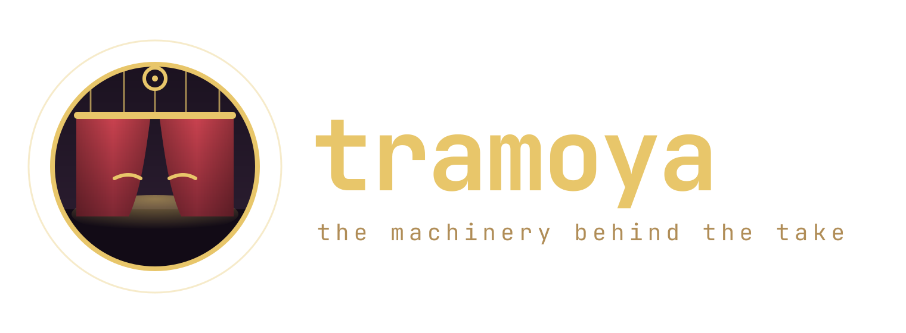
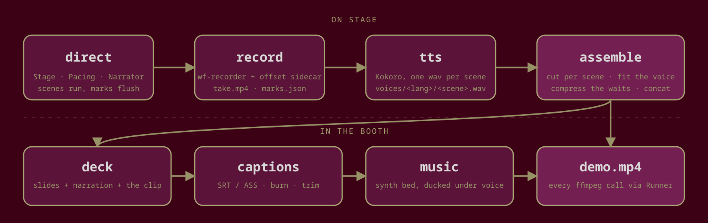
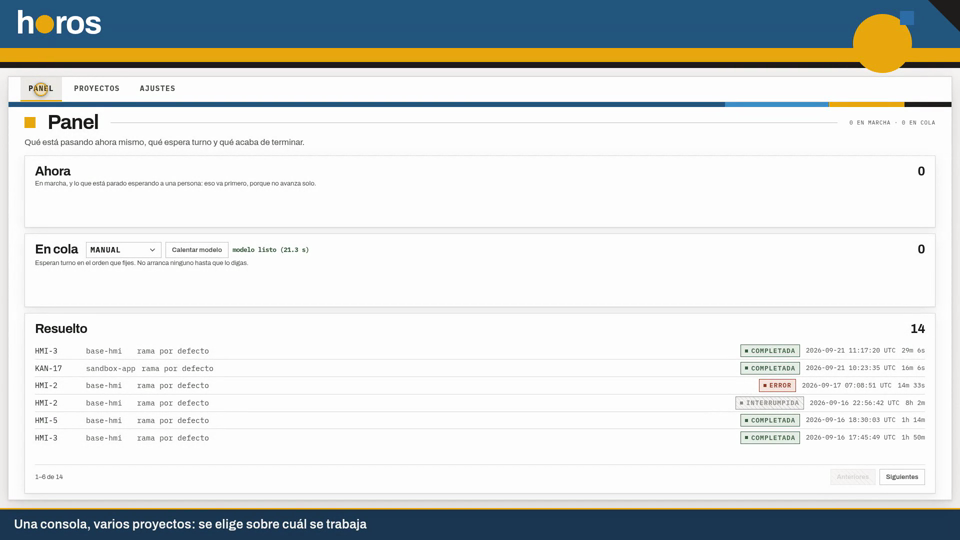
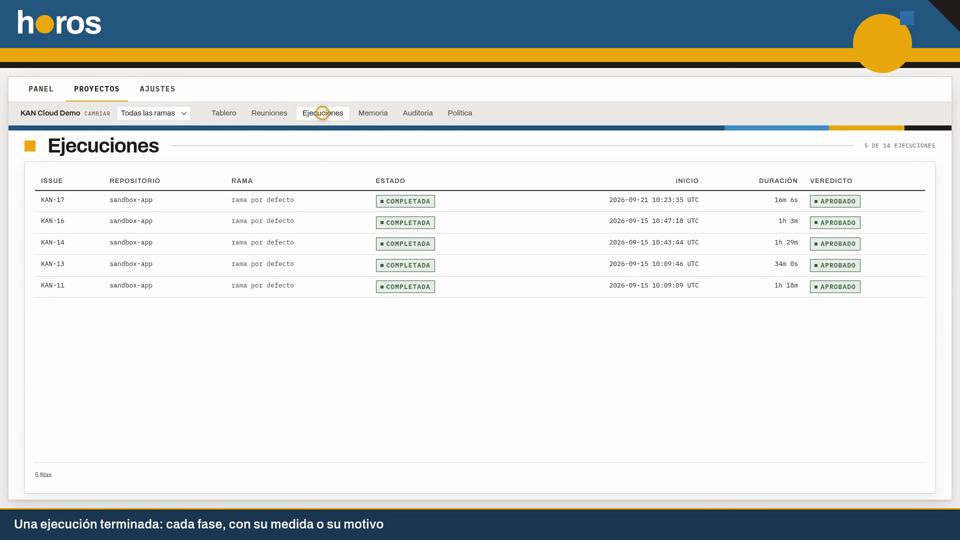
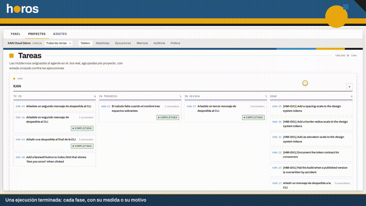
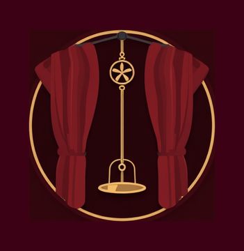

<div align="center">



<p>
<em>The <strong>tramoya</strong> is the machinery behind a stage: ropes, battens, trapdoors.<br>
The audience never sees it. The show runs on time because of it.</em><br>
<strong>This is that machinery for recorded software demos: you write scenes, it keeps the clock, the cursor, the voice and the cut.</strong>
</p>

<p>
  
  
  
  
  
</p>

<a href="#-install"><strong>Install</strong></a> ·
<a href="#-why-this-exists"><strong>Why</strong></a> ·
<a href="#-what-you-get"><strong>What you get</strong></a> ·
<a href="#-60-second-tour"><strong>60-second tour</strong></a> ·
<a href="#-the-pipeline"><strong>The pipeline</strong></a> ·
<a href="#-module-map"><strong>Module map</strong></a> ·
<a href="#-verification"><strong>Verification</strong></a>

</div>

---

<a href="#-the-pipeline"></a>

<div align="center">

**stage** Playwright · **recorder** wf-recorder · **voice** Kokoro · **cut** ffmpeg · **marks** one JSON file<br>
**core deps** none · **extras** `[playwright]` `[tts]` · **cli** `tramoya marks | assemble | deck | captions | music | cues | record | tts`

<br>

<sub>Two kinds of image on this page. The logo and the diagram are <b>rendered</b> from SVG by
<code>scripts/render-assets.sh</code>. Everything else is <b>real output</b>: the terminal GIF is an
<code>asciinema</code> recording of the installed command, and the stage frames are cut from a demo that
was directed, recorded and assembled with this package. No mock-ups, nothing hand-painted.</sub>

</div>

---

## 🎬 The take

<p align="center">
  
</p>

<p align="center"><sub>A marks file from a real take becomes a scene table; <code>assemble --dry-run</code> prints the twenty-seven
ffmpeg calls it would make and encodes nothing; <code>record --dry-run</code> shows the recorder argv.</sub></p>

<table>
<tr>
<td width="50%"></td>
<td width="50%"></td>
</tr>
<tr>
<td colspan="2" align="center"><sub>Two scenes of a product demo shot with <code>Stage</code>: the gold ring is the injected cursor, the dark band at the bottom is the caption
the scene registered. The product is <a href="https://github.com/gitsual/cci-ai-agent">Horos</a>, the first consumer of this package.</sub></td>
</tr>
</table>

<p align="center"></p>

---

## 📥 Install

```bash
pip install "tramoya @ git+https://github.com/gitsual/tramoya@v0.1.0"
pip install "tramoya[playwright] @ git+https://github.com/gitsual/tramoya@v0.1.0"   # + Stage
pip install "tramoya[tts] @ git+https://github.com/gitsual/tramoya@v0.1.0"          # + Kokoro voice
```

The core has **no Python dependencies**. `ffmpeg`, `ffprobe`, `wf-recorder`, `paplay` and `pactl` are
external binaries, looked up at run time only by the command that needs them. Pin the tag: the package is
consumed by git URL and the tag is the contract.

With `uv`, from a checkout:

```bash
uv venv && uv pip install -e ".[dev,playwright]"
tramoya --version
```

---

## 🎨 Why this exists

A product demo is a small film. Somebody has to keep the clock, move the cursor legibly, say the right
line at the right moment, remember where each scene started so the editor can cut, and then do the editing:
speed up the two minutes where the model was thinking, freeze the frame while the narration finishes,
burn the captions, lay a bed of music under the voice.

That machinery got written **three times** for the same product, once per generation of the demo script,
and a fourth time for a desktop tour that had nothing to do with the product. Marks were kept in three
slightly different JSON shapes. The scene timeline was written only when the director exited, so a crash
at scene nine left nothing. Pacing lived in three module globals that had to be kept in sync by hand.

None of that depended on what was being shown. So it moved here, under one name, with tests, and the
product now imports it. What stayed behind is exactly what belongs to the product: its pages, its script,
its texts.

**The rule that shapes the package:** every ffmpeg invocation goes through a `Runner`. In `dry_run` mode
it records the argv and touches nothing. That is what makes a video pipeline testable without paying an
encode per test, and what let the migration be checked by diffing argv against snapshots of the old scripts.

---

## ✨ What you get

| Piece | What it does | Where |
|---|---|---|
| **Marks** | A tiny timeline (`scene:<name>:start\|end`, `wait:start\|end`) flushed to disk after **every** mark, so a crashed take still leaves its marks. Loads the older Spanish-keyed files unchanged. | `marks.py` |
| **Pacing** | One object for tempo, language and rehearsal mode instead of three globals. `pace` scales every sleep and timeout; `rehearse` runs the whole choreography in seconds. | `pacing.py` |
| **Narrator** | Plays one voice clip per scene through an injectable player, falls back to a timed pause when the clip is missing, and never blocks the take on a missing file. | `narration.py` |
| **Stage** | A Playwright page with a **visible cursor**, a click ripple and a caption band injected into any web app, plus legible mouse travel and a scene registry with decorators. | `stage.py` |
| **Recorder** | Drives `wf-recorder` and writes the **offset sidecar**: the recorder's start and the director's start read from `/proc/<pid>/stat`, not guessed. `assemble` picks it up by itself. | `record.py` |
| **Cues** | Single-take mode: a `seconds\|text` cue file and a `k=v` meta file become marks or burn-ready ASS subtitles, recovering the pre-roll from the take's own duration. | `cues.py` |
| **Assembly** | Marks + take + voices → one video: cut per scene, compress any wait over 20 s to ~4 s with a *"3 minutes later"* caption, freeze the last frame if the voice runs long, pad if it runs short, normalise, concat. Slides + narration (+ a clip) → a deck video. | `assembly.py` |
| **Captions** | Split, wrap and page text into SRT or ASS with a legible boxed style; burn into a video; trim to ranges first. | `captions.py` |
| **Music** | A synthesized looping bed, mixed under the voice with sidechain ducking or flat with `--solo`. | `audio.py` |
| **TTS** | Kokoro text-to-speech, one wav per script key, per language. Optional extra. | `tts.py` |
| **CLI** | Every subcommand that would run ffmpeg or a recorder takes `--dry-run` and prints the exact argv. | `cli.py` |

---

## ⚡ 60-second tour

**Direct a take.** Scenes are functions; marks and pacing are handed to the stage once.

```python
from pathlib import Path
from tramoya.marks import Marks
from tramoya.pacing import Pacing
from tramoya.stage import SceneRegistry, open_stage

pacing = Pacing(pace=1.0, lang="en")
marks = Marks(path=Path("marks.json"))      # flushed after every mark
scenes = SceneRegistry()

@scenes.scene("board", "One console, several projects")
def board(stage):
    stage.click_text("Projects")
    stage.point_at("#board")
    stage.beat(2)

with open_stage("http://127.0.0.1:8765", pacing, marks, video_dir=Path("raw")) as stage:
    scenes.run_all(stage)
```

Outside a browser the same marks come from context managers:

```python
with marks.scene("intro", "Opening"):
    narrator.say("intro", fallback=6)
with marks.wait("model thinking"):
    wait_for_the_backend()
```

**Record the screen** while the director runs. The sidecar lines both clocks up.

```bash
tramoya record --out take.mp4 --geometry "0,48 1920x1032" --fps 10
```

**Give it a voice.** One wav per key and language, from a JSON script.

```bash
tramoya tts --script script.json --lang en --out-dir voices/en
```

**Assemble.** Check the plan first, then drop `--dry-run`.

```bash
tramoya assemble --video take.mp4 --marks marks.json --voice-dir voices/en --out demo.mp4 --dry-run
tramoya assemble --video take.mp4 --marks marks.json --voice-dir voices/en --out demo.mp4
```

**Wrap it in a deck**, burn captions, add music.

```bash
tramoya deck --slides slides/ --voice-dir voices/en --clip demo.mp4 --clip-duration 145 --out deck.mp4
tramoya captions burn --video deck.mp4 --subtitles deck.srt --out deck-captions.mp4 --trim 0-120,600-780
tramoya music bed --out bed.wav
tramoya music mix --video deck-captions.mp4 --bed bed.wav --out final.mp4
```

**Single continuous take** with a cue file instead of a director, as a desktop tour would do:

```bash
tramoya cues marks --cues take.cues --meta take.meta --duration "$(ffprobe ... take.mp4)" --out marks.json
tramoya cues ass   --cues take.cues --meta take.meta --duration 297.4 --width 1920 --height 1080 --out take.ass
```

---

## 🎞️ The pipeline

Two rooms. **On stage**, the director runs scenes and the recorder rolls. **In the booth**, nothing is
live: every step reads files and writes files, and every ffmpeg call is a value you can print.

```
direct   Stage · Pacing · Narrator        ──▶  marks.json
record   wf-recorder + offset sidecar     ──▶  take.mp4, take.mp4.offset.json
tts      script.json                      ──▶  voices/<lang>/<scene>.wav

assemble take + marks + voices            ──▶  demo.mp4     waits compressed, voice fitted per scene
deck     slides/*.png + voices (+ clip)   ──▶  deck.mp4     each page as long as its narration
captions cues or .srt                     ──▶  .ass / burnt video (trimmed first if asked)
music    bed.wav                          ──▶  mixed video, bed ducked under the voice
```

### The marks file

```json
[
  {"t": 4.31,  "key": "scene:opening:start", "label": "One console, several projects"},
  {"t": 16.16, "key": "scene:opening:end",   "label": "One console, several projects"},
  {"t": 40.0,  "key": "wait:start",          "label": "model"},
  {"t": 114.0, "key": "wait:end",            "label": "model"}
]
```

`t` is seconds since the director started. The recorder started a little earlier; the sidecar holds that
offset and `assemble` adds it. Files written by the older directors (`escena-3-inicio`, `espera-fin`,
rows named `clave` and `etiqueta`) load through the same function and give the same scene bounds. There is a
thirteen-scene one from a real take under `tests/fixtures/`.

### What `assemble` does per scene

1. Cut `[start, end)` out of the take, shifted by the offset.
2. Inside the scene, any wait window longer than 20 s is sped up to about 4 s with a caption saying how
   long it really was. The rest plays at normal speed.
3. If the scene's voice clip is longer than the scene, the last frame freezes until the voice ends. If it
   is shorter, silence pads the tail.
4. The voice is normalised with `loudnorm`; a scene with no clip gets a silent track so concat never sees
   mismatched streams.
5. Everything is concatenated once.

---

## 🗺️ Module map

```
src/tramoya/
├── marks.py       Mark · Marks (incremental flush) · load_marks · scene_bounds · wait_windows
├── pacing.py      Pacing(pace, rehearse, lang) · sleep · op_timeout
├── i18n.py        Messages · t(key, lang, **kw)
├── narration.py   Script · DeckScript · Narrator · wav_seconds
├── console.py     banner · step · note · ok · warn · fail · sim
├── stage.py       OVERLAY_JS · Stage · SceneRegistry · open_stage · AppProcess · http_ready   [playwright]
├── record.py      Recorder · wf_recorder_argv · offset_sidecar · read_sidecar · NullSink
├── cues.py        parse_cues_with_total · parse_meta · offset_from_duration · cues_to_marks · cues_to_ass
├── tts.py         synthesize · synthesize_script                                              [tts]
├── ffmpeg.py      Runner(dry_run) · probe_duration · filter recipes as pure functions
├── assembly.py    assemble_marks · plan_segments · assemble_deck · Segment
├── captions.py    split · wrap · page_cues · render_srt · render_ass · burn_argv · trim_plan
├── audio.py       build_loop · render_wav · duck_filter · solo_filter · mix_argv
└── cli.py         tramoya marks | assemble | deck | captions | music | cues | record | tts
```

Fourteen modules, about 2,300 lines. Anything that shells out is behind `Runner`; anything that needs
Playwright or Kokoro is behind an extra and skipped cleanly when the extra is absent.

---

## ✅ Verification

```bash
uv run ruff check src tests
uv run python -m pytest -q             # 204 fast tests, nothing is encoded
uv run python -m pytest -q -m slow     # 1 test: three real seconds through the whole pipeline
```

The fast suite runs every ffmpeg path in `dry_run` and asserts on the argv. The slow test renders a
`testsrc` clip, writes marks for two scenes, hands one of them a voice clip longer than the scene, and
checks the output duration: the freeze happened. It is the test that caught a typo in an `ffprobe` flag
that no dry run could see, and the one that taught us `loudnorm` returns NaN on digital silence, so the
fixture is a quiet tone.

CI runs the fast suite on Python 3.11 and 3.12, with and without the `playwright` extra
(`.github/workflows/ci.yml`).

---

## 🗂️ Repository map

```
tramoya/
├── src/tramoya/            the package (see the module map)
├── tests/                  one file per module + test_cli.py + test_slow_pipeline.py
│   └── fixtures/           legacy-marks-v11.json: thirteen scenes from a real take
├── assets/
│   ├── logo.svg → logo.png             rendered by scripts/render-assets.sh
│   ├── pipeline.svg → pipeline.png     rendered by scripts/render-assets.sh
│   ├── gifs/cli.gif                    asciinema recording of the installed CLI
│   ├── gifs/stage.gif                  six seconds of a real take
│   └── shots/                          frames of that take
├── scripts/
│   ├── render-assets.sh    regenerate every rendered asset; `shots` also cuts frames from $TAKE
│   └── cli-cast.sh         the script the CLI gif records
├── pyproject.toml          hatchling, extras playwright / tts / dev, ruff, pytest markers
└── .github/workflows/ci.yml
```

---

## 📚 Documentation

| Where | What |
|---|---|
| This README | The whole flow and the module map. |
| `tramoya <cmd> --help` | Every flag; the parser is the documentation of record. |
| Module docstrings | Each file opens with what it owns and why. |
| [Horos](https://github.com/gitsual/cci-ai-agent) `docs/DEMO-V7.md`, `docs/DEMO-VIDEO.md` | The first consumer: how a real product wires its script and pages into this package. |

---

## 📄 License

MIT. See [LICENSE](LICENSE).

<div align="center">
<br>

<br>
<sub>the machinery behind the take</sub>
</div>
